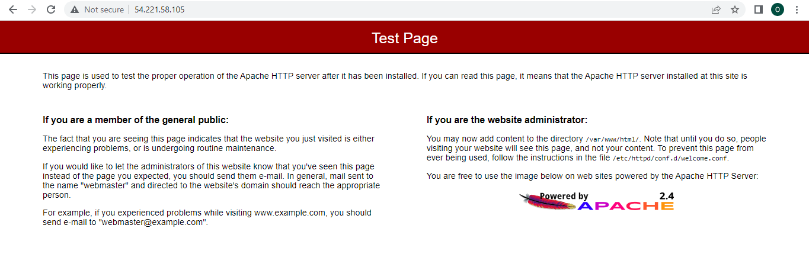

# Creating an EC2 instance in A Virtual Private Network
Using aws cloud formation I set up an EC2 instance in a VPC.
Write a CloudFormation script that will create the following two Resources: 
- A SecurityGroup
- An EC2 Instance
- Apache Web Server software

To achieve the same results you'll need the following
### Dependencies

##### 1. AWS account
- You would require to have an AWS account to be able to build cloud infrastructure. To create an AWS with a free tier, click [here](https://aws.amazon.com/premiumsupport/knowledge-center/create-and-activate-aws-account/). Or skip this step if you already have one.
- You will have to install AWS CLI. You can find steps for installing the AWS CLI [here](https://aws.amazon.com/cli/)
- You need to create a Keypair to use for SSH. You can achieve this by following the instructions [here](https://docs.aws.amazon.com/AWSEC2/latest/UserGuide/ec2-key-pairs.html#having-ec2-create-your-key-pair)

##### 2. VS code editor
An editor would be helpful to visualize the image as well as code. Download the VS Code editor [here](https://code.visualstudio.com/download).

## Important Info
I'm currently running all my commands on Visual studio after installing Ubuntu 20.04 on windows WSL. You can find the steps to achieve this [here](https://docs.microsoft.com/en-us/windows/dev-environment/javascript/nodejs-on-wsl)

You can then clone/fork the repo and look at the template I used. The template is the ```task1.yml``` and the parameters in the ```task1-parameters.json```.

## Important notice
Make sure to change the following values to yours
1. The AMI ID
2. PublicSubnet
3. Your VPC ID

To create/deploy your cloudformation template, run the following command

```
$aws cloudformation create-stack --stack-name myChallenge --region us-east-1 --template-body file://task1.yml --parameters file://task1-parameters.json
```

Kindly replace myChallenge with your stackname, task1.yml with a filename of your choice and task1-parameters.json with a name of your choice.

### Important
We want a script to run automatically at the time of provisioning of the EC2 instance. In the UserData section of this EC2 server, I wrote a script that will deploy the Apache Web Server software that we can then use to verify that the machine correctly deployed. The script installs, and starts the Apache Web Server in the new EC2 instance. Also, it will enable this service to start automatically after reboot.

### Expected result
To verify, you will use the public IP address of the newly launched EC2 instance, and paste it in a new browser window. You should see the Apache web server test page like the one below.



### Cleaning up
To delete the stack to prevent additional costs by AWS. Run the command below and also login to your AWS console to verify that your stack has been deleted.

```
aws cloudformation delete-stack --stack-name myChallenge
```

Where `myChallenge` is the name of your stack.
Your console should look like the pic below


